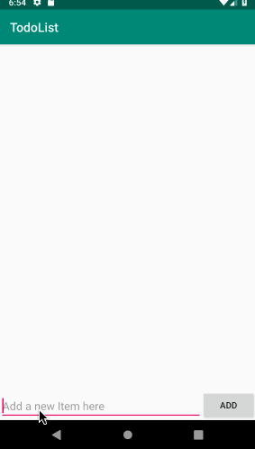

# Pre-work - *TodoList*

**TodoList** is an android app that allows building a todo list and basic todo items management functionality including adding new items, editing and deleting an existing item.

Submitted by: **Tiara Sykes**

Time spent: **5** hours spent in total

## User Stories

The following **required** functionality is completed:

* [x] User can **successfully add and remove items** from the todo list
* [x] User can **tap a todo item in the list and bring up an edit screen for the todo item** and then have any changes to the text reflected in the todo list.
* [x] User can **persist todo items** and retrieve them properly on app restart

The following **optional** features are implemented:

* [ ] Persist the todo items [into SQLite](http://guides.codepath.com/android/Persisting-Data-to-the-Device#sqlite) instead of a text file
* [ ] Improve style of the todo items in the list [using a custom adapter](http://guides.codepath.com/android/Using-an-ArrayAdapter-with-ListView)
* [ ] Add support for completion due dates for todo items (and display within listview item)
* [ ] Use a [DialogFragment](http://guides.codepath.com/android/Using-DialogFragment) instead of new Activity for editing items
* [ ] Add support for selecting the priority of each todo item (and display in listview item)
* [ ] Tweak the style improving the UI / UX, play with colors, images or backgrounds

The following **additional** features are implemented:

* [ ] List anything else that you can get done to improve the app functionality!

## Video Walkthrough

Here's a walkthrough of implemented user stories:

GIF created with [LiceCap](http://www.cockos.com/licecap/).

## Project Analysis

As part of your pre-work submission, please reflect on the app and answer the following questions below:

**Question 1:** "What are your reactions to the Android app development platform so far? Compare and contrast Android's approach to layouts and user interfaces in past platforms you've used."

**Answer:** I was impressed by Android Studio’s robust and intuitive VCS Integration. In comparison to XCode, Android Studio has more options for VCS Integration; XCode only supports Git for version control, whereas Andriod Studio supports Git, Github, Subversion, CVS, Google Cloud, and Mercurial. These options for version control allows developers to collaborate on a project, store versions of projects after making changes, and restore previous versions of a project if changes are nonviable. This feature will make it much easier to backup projects that I work on and makes it easier to store projects safely remotely. 
Android Studio and XCode both have layout editors that allow drag and drop UI design. The Interface Builder in XCode wires components to code visually. However, Andriod Studio components must be inflated manually in code in MainActivtity. In addition, the file format for UI files in Interface Builder is proprietary, whereas the file format for layout files in Andriod Studio is XML, which makes the layout file self-describing and human readable.

**Question 2:** "Take a moment to reflect on the `ArrayAdapter` used in your pre-work. How would you describe an adapter in this context and what is its function in Android? Why do you think the adapter is important? Explain the purpose of the `convertView` in the `getView` method of the `ArrayAdapter`."

**Answer:** An adapter in the context of this app creates a View, a building block for UI components, for each item in the data set. As a result, data that is stored in a data set such as an ArrayList is loaded on an Adapter View such as `ListView` so that the users can see the item on the interface and the programmer can easily store and convert data while programming. An `ArrayAdapter` is a type of adapter that returns a View for each item in a data set which would be used with a list-based user interface widgets such as `ListView`. According to the Android Documentation, the `convertView` parameter in the `getView` method of the `ArrayAdapter` reuses old Views. In other words, the `ArrayAdapter` uses `convertView` to reuse old Views that are no longer being used. This allows the `ListView` to send reusable Views to the adapter so that the Adapter can use it to display a new item on the ListView rather than instantiate a new object. The `convertView` increases the performance of the `ArrayAdapter` so that it is not using more memory than necessarily to display information in a list. 
 

## Notes

Describe any challenges encountered while building the app.

## License

    Copyright 2018 Tiara Sykes

    Licensed under the Apache License, Version 2.0 (the "License");
    you may not use this file except in compliance with the License.
    You may obtain a copy of the License at

        http://www.apache.org/licenses/LICENSE-2.0

    Unless required by applicable law or agreed to in writing, software
    distributed under the License is distributed on an "AS IS" BASIS,
    WITHOUT WARRANTIES OR CONDITIONS OF ANY KIND, either express or implied.
    See the License for the specific language governing permissions and
    limitations under the License.
